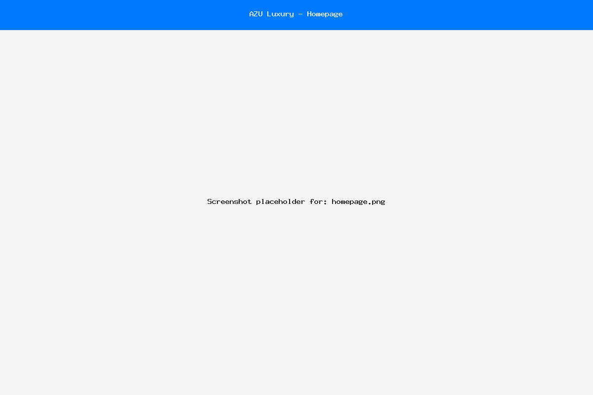
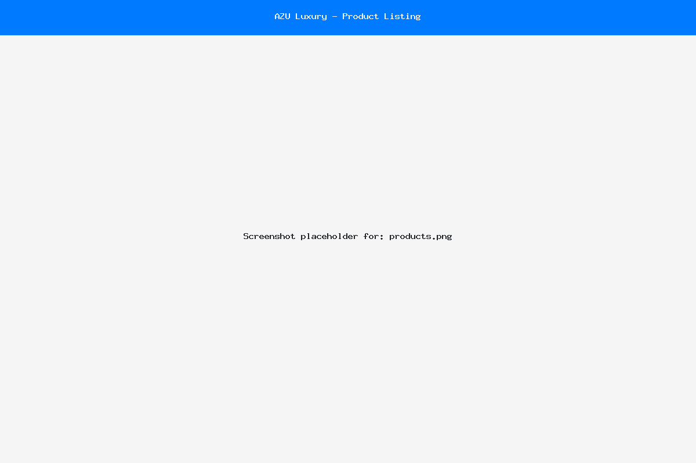
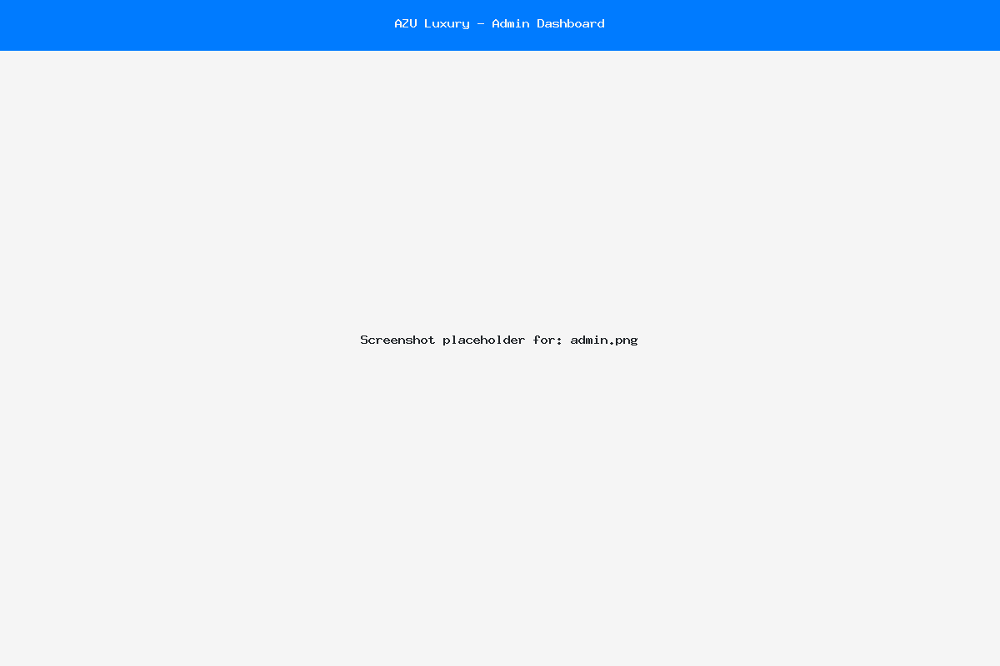
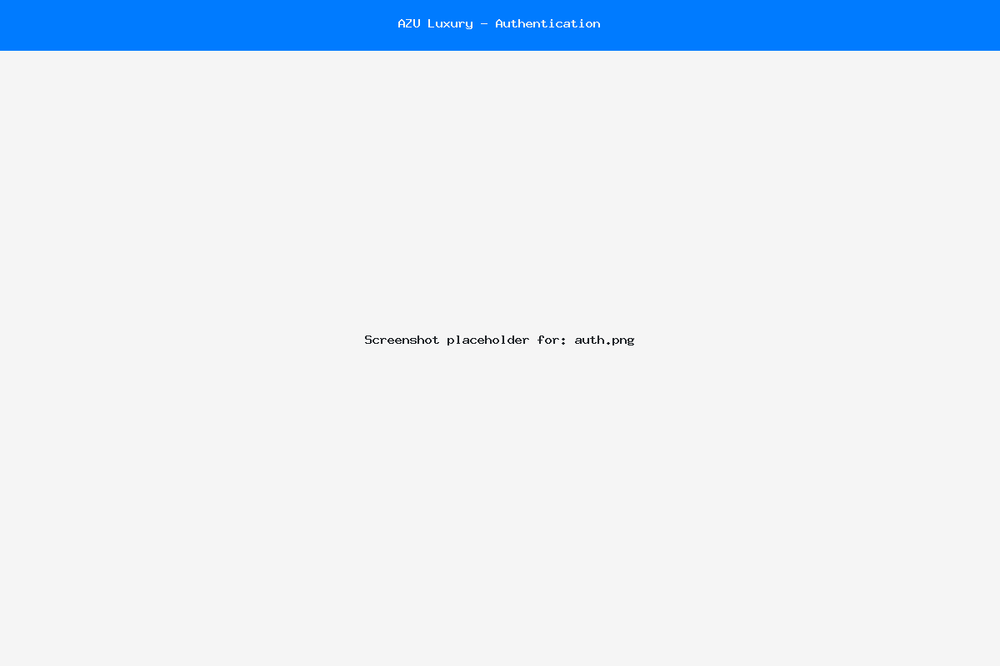
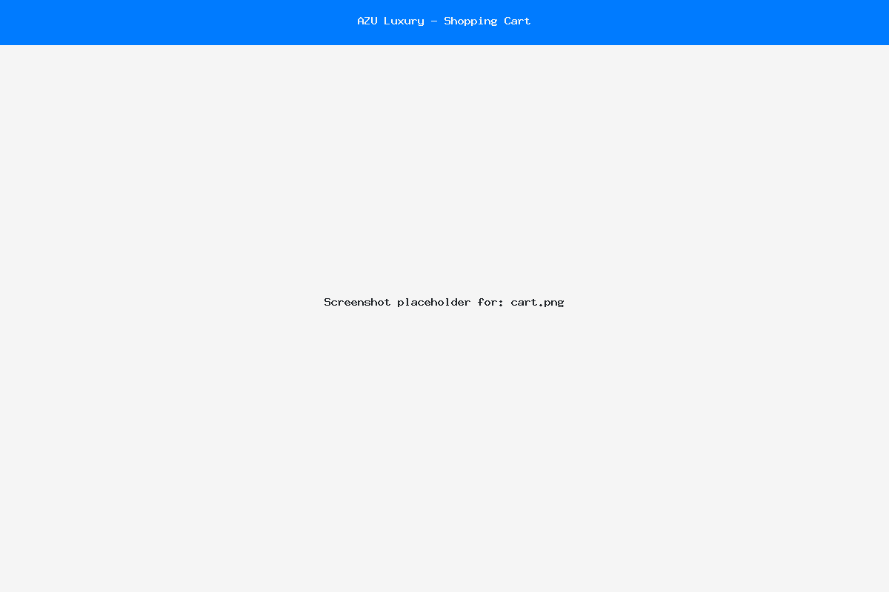

# AZU Luxury E-commerce Platform - Project Report

## Introduction
AZU is a luxury e-commerce platform designed to provide a premium shopping experience for high-end fashion products. The platform combines elegant design with robust functionality to create a seamless shopping experience for users while providing powerful management tools for administrators.

## Technology Stack & Motivation

### Backend Technologies
- **PHP 8.3**: Chosen for its robust web development capabilities, extensive community support, and excellent integration with MySQL.
- **MySQL Database**: Selected for:
  - Reliable data persistence
  - Complex relationship management
  - Transaction support
  - Scalability
  - Data integrity

### Frontend Technologies
- **HTML5/CSS3**: Modern markup and styling
- **JavaScript**: Dynamic client-side interactions
- **Bootstrap 5**: Responsive design framework
- **Font Awesome**: Professional iconography
- **jQuery**: Enhanced DOM manipulation and AJAX calls

### Development Decisions

1. **Database Design**
   - Normalized schema with proper relationships
   - Separate tables for users, products, categories, and orders
   - Foreign key constraints for data integrity

2. **Security Measures**
   - Password hashing for user credentials
   - Prepared statements to prevent SQL injection
   - Session management for authentication
   - Admin role verification

3. **User Experience**
   - Responsive design for all devices
   - Interactive chatbot for customer support
   - Clean and intuitive navigation
   - Category-based product organization

4. **Admin Features**
   - Product management (CRUD operations)
   - Category management
   - User management
   - Order tracking (planned)

## Screenshots

### Homepage

- Clean, modern design
- Featured products display
- Category navigation
- Search functionality

### Product Listing

- Grid layout for products
- Price and description display
- Category filtering
- Responsive design

### Admin Dashboard

- Product management interface
- Add/Edit/Delete functionality
- Category management
- Order overview

### User Authentication

- Login interface
- Registration form
- Password recovery

### Shopping Cart

- Cart management
- Price calculation
- Quantity adjustment
- Checkout process

## Future Enhancements
1. Order management system
2. Advanced search filters
3. User reviews and ratings
4. Inventory management
5. Analytics dashboard
6. Payment gateway integration

## Conclusion
The AZU Luxury E-commerce Platform successfully implements all required features while maintaining a focus on user experience and administrative efficiency. The combination of PHP, MySQL, and modern frontend technologies creates a robust and scalable solution for luxury e-commerce needs.
